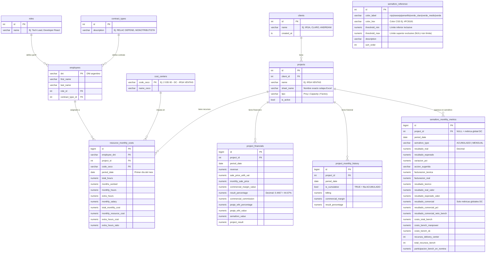

# Diagrama Entidad-Relación — Proyectos Activos CFOTech

Generado en base a `schema.sql` y la estructura del Excel `Proyectos Activos 2026.xlsx`.

---

## ER Diagram (Mermaid)

---

## Relaciones clave

| Relación | Cardinalidad | Descripción |
|----------|-------------|-------------|
| `clients` → `projects` | 1:N | Un cliente tiene N proyectos |
| `projects` → `resource_monthly_costs` | 1:N | Un proyecto tiene N imputaciones mensuales |
| `projects` → `project_financials` | 1:N | Un proyecto tiene un financiero por período |
| `projects` → `project_monthly_history` | 1:N | Un proyecto tiene N filas históricas |
| `projects` → `semaforo_monthly_metrics` | 1:N | Un proyecto aparece en N períodos del semáforo |
| `employees` → `resource_monthly_costs` | 1:N | Un empleado puede estar en N proyectos/períodos |
| `roles` → `employees` | 1:N | Un rol puede tener N empleados |
| `contract_types` → `employees` | 1:N | Un tipo de contrato para N empleados |
| `cost_centers` → `resource_monthly_costs` | 1:N | Un CeCo para N imputaciones |

---

## Inventario de solapas → tablas

| Solapa Excel | Tabla destino | Notas |
|---|---|---|
| `SEMAFORO GENERAL` | `semaforo_monthly_metrics` | Cuadros ACUMULADO + MENSUAL |
| `SEMAFORO GENERAL` (métricas DC) | `semaforo_monthly_metrics` (project_id=NULL) | Resultado comercial, bench |
| `SEMAFORO DE REFERENCIA` | `semaforo_reference` | Datos fijos, pre-cargados |
| `[NOMBRE] REAL` — header | `clients`, `projects`, `cost_centers` | Upsert en ingesta |
| `[NOMBRE] REAL` — filas de empleados | `employees`, `roles`, `contract_types`, `resource_monthly_costs` | Upsert por DNI |
| `[NOMBRE] REAL` — bloque financiero | `project_financials` | 1 fila por período |
| `[NOMBRE] REAL` — tabla histórica | `project_monthly_history` | Filas ACUMULADO + meses |
| `CONTRATOS DC`, `NOMINA DC` | (extensión futura) | No incluidas en este schema |
| `BENCH`, `PARAMETRIA`, `DATOS`, `KPI` | (extensión futura) | No incluidas en este schema |

---

## Proyectos detectados en el Excel

| Solapa proyecto | Solapa REAL | Cliente inferido |
|---|---|---|
| BCO DEL SOL T- | BCO DEL SOL T- REAL | BCO DEL SOL |
| IRSA VENTAS | IRSA VENTAS REAL | IRSA |
| IRSA SOPORTE COCHERAS | IRSA SOPORTE COCHERAS REAL | IRSA |
| ECONORENT | ECONORENT REAL | ECONORENT |
| UKENNEDY | UKENNEDY REAL | UKENNEDY |
| INFOBAE SOPORTE | INFOBAE SOPORTE REAL | INFOBAE |
| Andreani Warehouse | Andreani Warehouse REAL | ANDREANI |
| Andreani INT Y COM (ECO) | Andreani INT Y COM (ECO) REAL | ANDREANI |
| Andreani WOS | Andreani WOS REAL | ANDREANI |
| ICBC | ICBC REAL | ICBC |
| CLARO CML | CLARO CML REAL | CLARO |
| CLARO VENTAS | CLARO VENTAS REAL | CLARO |
| Cooperativa Union | Cooperativa Union REAL | COOPERATIVA UNION |
| Coop UNION SOPORTE | Coop UNION SOPORTE REAL | COOPERATIVA UNION |
| GRUPO Life | GRUPO Life REAL | GRUPO LIFE |
| PNET INT VISMA | PNET INT VISMA REAL | PNET |
| Stellantis | Stellantis REAL | STELLANTIS |
| BCO SUPERVIELLE | BCO SUPERVIELLE REAL | BCO SUPERVIELLE |
| IRSA NUEVO | *(sin solapa REAL — pendiente)* | IRSA |
| PELLEGRINI | *(sin solapa REAL — sin datos)* | PELLEGRINI |
